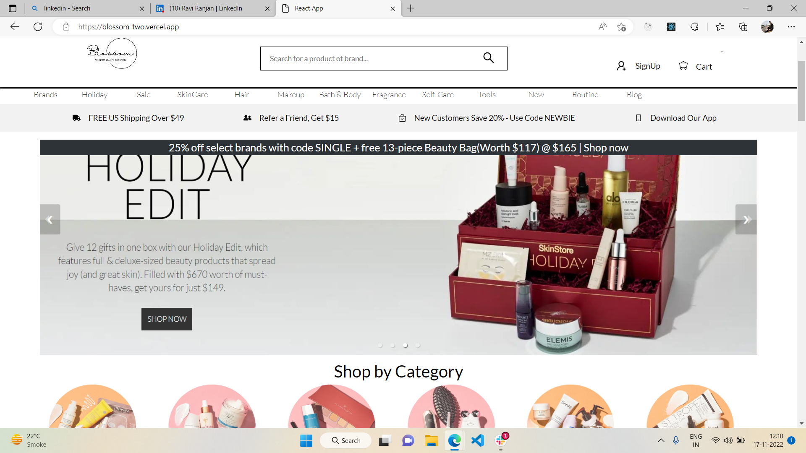
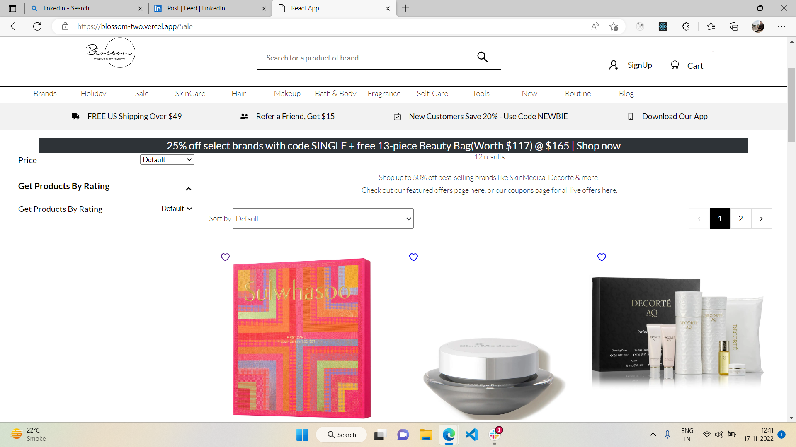
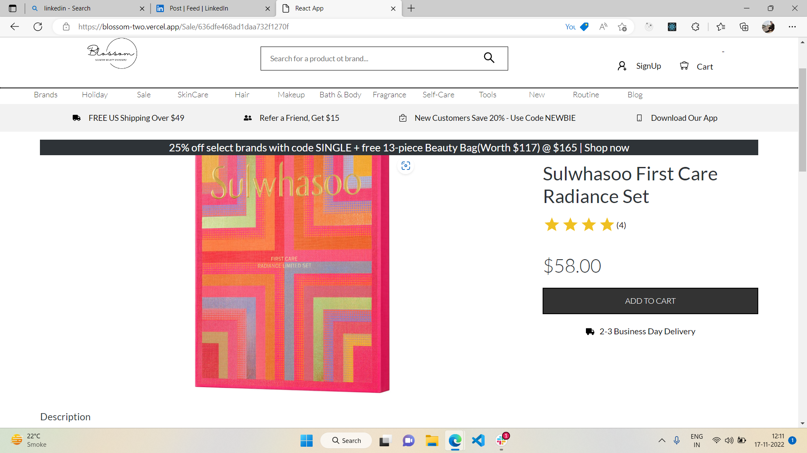
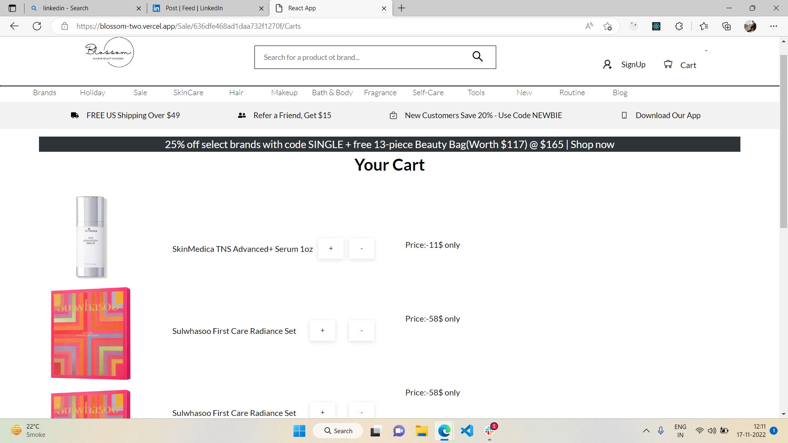
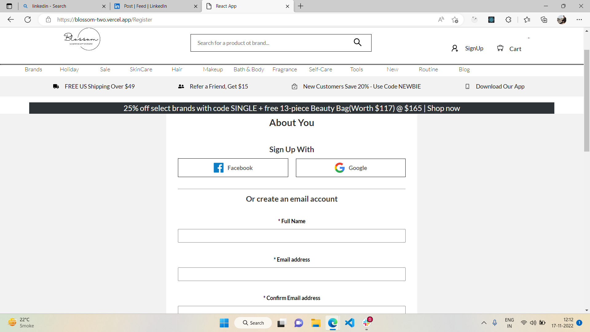
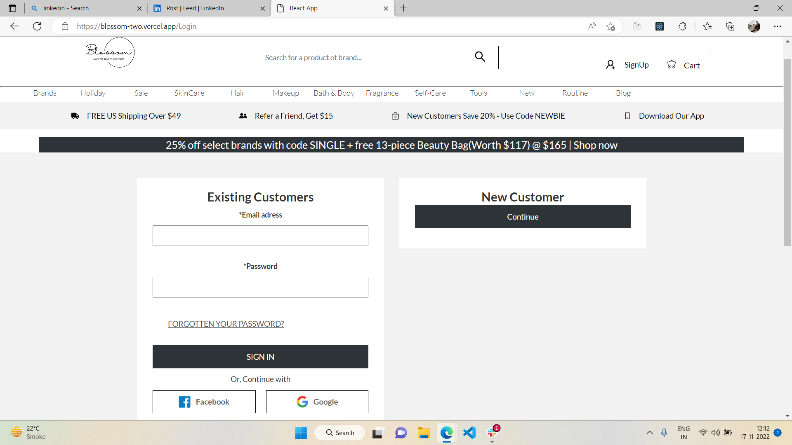

# Blossom
​
    This website is a clone of SkinStore which is an e-commerce website which caters the latest innovative clinical skincare and luxury spa products.
​
# Project look like this
# HomePage

# Products Page

# Products Specifications Page

# Cart Page

# Signup Page

# Login Page

​
[Video presentation of this project](https://drive.google.com/file/d/128jVVwKv2TntuZ8ulj2n_6N74kg6HkAO/view?usp=sharing) 
​
## Build with

<table  align=center>
  <tr>
 <td align=center> </td>
     <td align=center> </td>
    <td align=center> </td>
     <td align=center> </td>
  </tr><tr><td align=center>  </td>
   <td align=center> </td>
  <td align=center> </td>
  <td align=center> </td>
  </tr>

</table>

 

## Tech Stack
​
    HTML | CSS | JavaScript | React | MongoDB | Express | Node JS | Redux |
​
### `A collaborative project built by a team of 4, executed in 4 days with both frontend and backend technology.`
 

## ✅ **Netlify link** [Click Here To See Magic](https://blossom-two.vercel.app/)

## 🤝 **_Collaborators_**

# 🧔🏻 **Nandlal Saw ** `Team Leader`

- Github: [Nandlal](https://github.com/NandlalShah955)
- Linkedin: [Nandlal](https://www.linkedin.com/in/nandlal-saw-a2761822b/)
- Email: (nandlalsaw789@gmail.com)
 
-Portfolio: [Nandlal](https://nandlalshah955.github.io/)

# 👨🏻 **Nitesh Samaniya ** 

- Github: [Nitesh](https://github.com/Nitesh-Samaniya)
- Linkedin: [Nitesh](https://www.linkedin.com/in/nitesh-samaniya-5b2563233/)
-Portfolio: [Nitesh](https://nitesh-samaniya.github.io/)

# 👨🏻 **Ravi Ranjan ** 
- Github: [Ravi](https://github.com/Ravi-047)
- Linkedin: [Ravi](https://www.linkedin.com/in/ravi-ranjan-136844231/)

# 👦**Bharat Haldandi ** 
- Github: [Bharat](https://github.com/bharathaladandi)
- Linkedin: [Bharat](https://www.linkedin.com/in/bharat-b-99a680242/)

# Installation
  npm install create-react-app blossom
   
  cd blossom
   
  npm start

